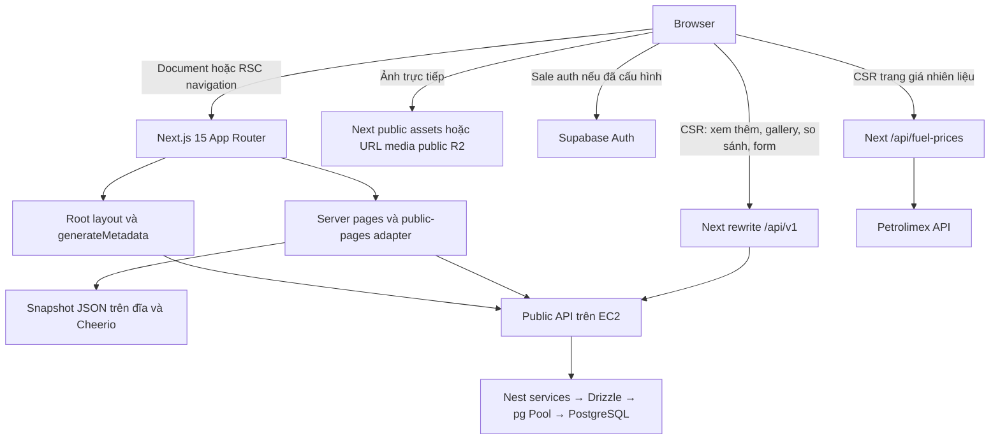
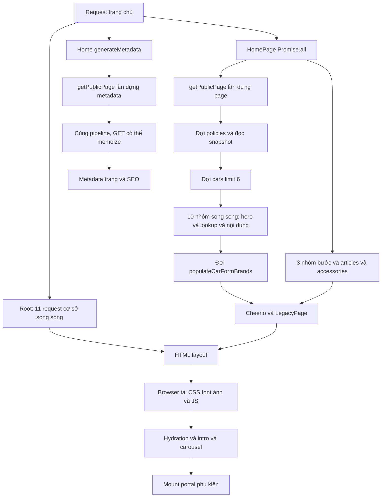
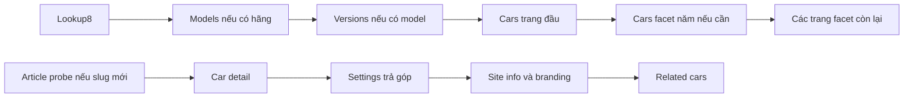

# Performance Audit — web-xeluottoantrung

Ngày kiểm tra: **04/10/2026**. Phạm vi: source web, tài nguyên `public/`, artifact build hiện có và phần backend liên quan đến các request public. **Chỉ phân tích; chưa triển khai bất kỳ tối ưu hóa nào.**

Quy ước bằng chứng:

- **CONFIRMED**: thấy trực tiếp trong source, thống kê file hoặc phép đo được ghi rõ.
- **HIGHLY LIKELY**: cơ chế có bằng chứng mạnh nhưng chưa đo mức đóng góp vào thời gian tải trang.
- **NEEDS MEASUREMENT**: cần trace/network/profile để kết luận.
- Dung lượng trong báo cáo dùng **MB thập phân = 1.000.000 byte**, KB = 1.000 byte. Dung lượng trên đĩa không đồng nghĩa với dung lượng truyền mạng.
- Số dòng tham chiếu là source tại thời điểm audit. Các request dùng trong phép đo đều là GET public, không thay đổi database.

## 1. Executive Summary

1. **SSR phụ thuộc nhiều request remote không có cache giữa các lượt truy cập.** Root layout chờ 11 request cơ sở, kể cả dữ liệu footer và nội dung ít thay đổi. Trang chủ còn có chuỗi `policies → cars → 10 nhóm dữ liệu → brands`. Đây là ưu tiên đầu tiên khi điều tra document chậm.
2. **Ảnh và font đang quá nặng so với kích thước hiển thị.** `images.unoptimized: true`; phần lớn ảnh dùng `` với URL trực tiếp. Logo mặc định 4,103 MB; hai font SF Pro tổng 4,529 MB. Gallery chi tiết dựng tất cả ảnh lớn và dùng cùng ảnh cho thumbnail.
3. **Toàn site chịu tải CSS và JS dùng chung lớn.** 10 stylesheet legacy = 603,268 KB, cộng CSS ứng dụng. Root import Supabase SDK và hệ thống tương tác/so sánh toàn site; nhiều trang legacy được parse HTML lại trong client boundary.
4. **Metadata gọi lại toàn bộ trình dựng trang** trên trang chủ và catch-all. GET trùng có thể được Next gộp trong một render; việc đọc snapshot, biến đổi Cheerio và tạo markup vẫn bị lặp. Không nên kết luận số request mạng bằng số lần gọi hàm.

**Mức độ:** các vấn đề cấu trúc đã xác nhận thuộc P1/P2. Chưa có P0 được xác minh bằng trace của lần tải 10–30 giây. Gallery lớn, root fetch không có deadline và cold SSR nhiều chặng là các ứng viên có thể đạt mức P0 trong điều kiện xấu, cần đo riêng.

### Phép đo và giới hạn

Số liệu người dùng cung cấp: 137 request; 63,8 MB transferred; 78,9 MB resources; DOMContentLoaded 16,47s; Load 21,06s; Finish 32,87s. Route, viewport, trạng thái cache và dev/production của lần đo này chưa được xác định. **Không coi đây là phép đo mới của audit.** Thời gian document và DOMContentLoaded là hai chỉ số khác nhau, dù cùng xuất hiện con số 16,47s trong mô tả.

Audit thử tuần tự bốn GET từ máy làm việc tới API đang cấu hình trong `.env.local`:

| Endpoint | HTTP | Nhận headers | Nhận hết body | Body giải mã | Content-Encoding / Cache-Control |
|---|---:|---:|---:|---:|---|
| `/api/v1/cars?limit=6&sort=newest`, lần 1 | 200 | 1.696 ms | 1.700 ms | 4.200 byte | Không có / không có |
| Cùng endpoint, lần 2 | 200 | 880 ms | 881 ms | 4.200 byte | Không có / không có |
| `/api/v1/brands` | 200 | 421 ms | 421 ms | 3.250 byte | Không có / không có |
| `/api/v1/content?group=thiet-lap-chinh-sach-dieu-kien` | 200 | 428 ms | 429 ms | 7.767 byte | Không có / không có |

Đây là mẫu nhỏ với Node fetch, không phải benchmark p95, không phải Next SSR và không đo bên trong EC2. Lần đầu/lần sau không chứng minh cold database hay TLS là nguyên nhân. Các GET ban đầu trong sandbox bị `EACCES`; phép đo thành công được thực hiện với quyền mạng được công cụ cho phép. Không đưa lỗi sandbox vào kết luận về EC2.

Không chạy browser tải toàn trang hoặc khởi động dev server, tránh tạo artifact và nhầm chi phí compile development với production. Dùng build có sẵn để phân tích bundle; không chạy lại build trong task này.

## 2. Current Architecture



### Cấu trúc và thời điểm thực thi

| Thành phần | Vai trò / thời điểm |
|---|---|
| `app/layout.tsx` | Server Component async, fetch dùng chung trước khi trả cây layout; metadata lấy tên website và branding |
| `app/page.tsx`, `app/[...slug]/page.tsx` | SSR runtime; xây lại nội dung snapshot bằng API, metadata gọi cùng trình dựng |
| Các route riêng trong `app/` | Server pages cho bài viết, FAQ, phụ kiện, tuyển dụng, dịch vụ, giới thiệu; client viewer cho tiện ích |
| `lib/public-api.ts` | Server fetch trực tiếp `API_URL`, fallback `NEXT_PUBLIC_API_URL`, cuối cùng localhost:4000 |
| `lib/public-client.ts`, `lib/auspicious-date.ts` | Browser fetch đường dẫn tương đối, qua Next rewrite tới API |
| `lib/pages.ts`, `data/pages/`, `data/route-manifest.json` | Đọc/parse snapshot mỗi lần dựng trang; không phải static HTML đã tối ưu sẵn |
| `components/common/LegacyContent.tsx`, `Markup.tsx` | Client boundary parse HTML thành React, thay các marker bằng component tương tác |
| `components/sale/SaleAccess.tsx` | Provider global; Supabase auth, đăng nhập, request riêng của sale |
| `app/api/fuel-prices/route.ts` | Route handler dynamic, fetch nguồn ngoài có timeout 10s |
| `public/`, `app/globals.css` | Static media/font/legacy CSS và stylesheet ứng dụng |
| `scripts/` | Công cụ kiểm tra/export, không thuộc runtime người dùng; không chạy script có khả năng ghi admin/DB |

`package.json`: Next 15.5.25, React 19.1.1, react-slick 0.31, html-react-parser 6, Cheerio 1.2, Supabase JS 2. Không thấy React Query, SWR, axios, GSAP hay framework animation ngoài trong dependencies/runtime đang rà soát.

Không có `pages/` source, middleware hoặc nested layout trong source web được tìm thấy; root layout là điểm dùng chung. Không thấy server action `use server`. Rewrite được cấu hình trong `next.config.ts:8–11`; cần phân biệt SSR trực tiếp API với CSR đi thêm qua Next.

`.env.local` hiện chọn API EC2 qua HTTP. Không chép giá trị khóa/auth/connection string vào báo cáo. Supabase auth là nhánh riêng; PostgreSQL location, region, Supabase pooler mode thực tế cần kiểm tra deployment, không suy từ frontend dependency.

**Build-time:** compile/bundle, có thể thực thi cơ chế xác định rendering của Next. **Runtime:** các route public phải dựng động do root dùng nhiều fetch no-store; không có `generateStaticParams` trong source. **CSR:** hydration và tương tác sau đó. Server Component truyền `children` qua provider client vẫn giữ khả năng SSR; root không biến toàn bộ source thành CSR-only.

## 3. Current Page Loading Flow

Trang chủ có các nhánh có thể được Next chạy đồng thời, không phải `layout → page` luôn chạy nối tiếp:



Chi tiết: `getPublicPage` đợi policies (`lib/public-pages.ts:722`), snapshot (`734`), cars (`742`), nhóm Promise.all (`746–756`), cuối cùng brands cho form (`817`). Hero slides không bắt đầu trước khi cars xong, dù không phụ thuộc cars.

Root `Promise.allSettled` (`app/layout.tsx:34–45`) chỉ giúp xử lý lỗi từng nhóm; **vẫn đợi tất cả settle** trước khi JSX layout xuất hiện. `Suspense` duy nhất ở cuối layout bao quanh `SiteInteractions`, không bao quanh fetch root hoặc các section trang chủ. Không có `loading.tsx` được tìm thấy. Metadata có thể stream trên trình duyệt thường ở Next 15.5; bot bị giới hạn HTML phải đợi metadata. Không khẳng định toàn bộ metadata đều chặn first byte trên Chrome.

## 4. Confirmed Bottlenecks

### PERF-001 — Root layout đợi dữ liệu của cả header và footer

- **Severity:** P1. **Confidence:** CONFIRMED về chuỗi chờ; thời gian đóng góp NEEDS MEASUREMENT.
- **Files / function:** `app/layout.tsx:33–60`, `RootLayout`; `lib/public-api.ts:14–17`.
- **Affected routes:** toàn bộ route dùng root layout, kể cả tiện ích và 404.
- **Evidence / current flow:** 11 request cơ sở, song song, gồm branches, regions, services, footer settings, nút gọi, chính sách, branding, mạng xã hội, ứng dụng và thông tin website. JSX chỉ được trả sau Promise.allSettled.
- **Why slow:** độ trễ root bị chi phối bởi request chậm nhất, cộng pagination nếu lookup >100. Dữ liệu footer cũng nằm trên đường trả layout đầu tiên.
- **Local / remote:** local làm thời gian round trip nhỏ; remote cộng network, DB, pool queue. 11 request song song không có nghĩa cộng 11 lần 0,88s.
- **Recommended fix:** cache nội dung ổn định với invalidation từ admin; tách dữ liệu cần cho header khỏi footer/section, dùng streaming phù hợp.
- **Expected impact:** giảm nền TTFB trên nhiều route, giảm áp lực API và DB cho mỗi khách.
- **Risk:** dữ liệu admin có thể chậm cập nhật nếu chỉ TTL; cần thiết kế invalidate/tag và fallback rõ ràng.

### PERF-002 — Waterfall trang chủ và payload dưới fold chặn page

- **Severity:** P1. **Confidence:** CONFIRMED.
- **Files / function:** `lib/public-pages.ts:721–818`, `getPublicPage('/')`; `app/page.tsx:27–32`.
- **Affected routes:** `/`.
- **Evidence:** policies → snapshot → cars → 10 nhóm → brands; trang chủ còn đợi accessories limit 100, articles và 3 nhóm bước trong Promise.all ngoài.
- **Current flow:** hero, reviews, quy trình, cả tab không hoạt động được chuẩn bị trước page hoàn tất.
- **Why slow:** nhiều chặng độc lập bị nối tiếp; một API phần dưới fold chậm vẫn giữ page pending. `.catch(() => null)` của accessories không giới hạn thời gian chờ.
- **Local / remote:** mỗi chặng remote thêm hàng trăm ms; local thường che chi phí này.
- **Recommended fix:** khởi tạo request độc lập sớm; streaming/defer reviews, accessories, news và tab chưa xem; giữ nội dung chính SSR.
- **Expected impact:** giảm thời gian tới hero và nội dung chính; giới hạn payload trang chủ.
- **Risk:** đổi thứ tự xuất hiện có thể gây CLS; cần skeleton/kích thước dự trữ và kiểm tra SEO.

### PERF-003 — Metadata dựng lại toàn trang

- **Severity:** P1. **Confidence:** CONFIRMED về gọi hàm/CPU lặp; HTTP duplicate cần đo.
- **Files / function:** `app/page.tsx:15–16,27–28`; `app/[...slug]/page.tsx:12–21`; `lib/pages.ts:22–34`; `lib/page-metadata.ts:36–49`.
- **Affected routes:** `/`, danh sách/chi tiết xe, brand/model routes, bài tin legacy, bán xe, lên đời, policy.
- **Evidence / current flow:** page và generateMetadata cùng gọi `getPublicPage`. Hàm không dùng React cache; đọc JSON, chạy Cheerio và tạo nội dung đầy đủ để cuối cùng lấy title/description/image.
- **Why slow:** lặp biến đổi HTML, đọc snapshot và điều phối API. Metadata còn đợi SEO sau trình dựng trang. GET giống hệt có thể được Next request memoization gộp; đây không phải bằng chứng API bị gọi gấp đôi.
- **Local / remote:** CPU vẫn lặp cả hai môi trường; remote làm các nhánh không gộp được hoặc miss cache đắt hơn. Với bot, nhánh metadata có thể trực tiếp giữ HTML.
- **Recommended fix:** loader metadata chỉ lấy dữ liệu tối thiểu; chia sẻ loader theo request với key ổn định; tránh tạo cả carousel/gallery để lấy OG image.
- **Expected impact:** giảm CPU và đường chờ metadata; HTTP giảm tùy duplicate thực tế.
- **Risk:** metadata/listing phải nhất quán với dữ liệu hiển thị; cache tham số sai có thể dùng metadata của bộ lọc khác.

### PERF-004 — No-store áp dụng quá rộng, không có deadline cho server API

- **Severity:** P1; nguy cơ P0 nếu upstream treo lâu. **Confidence:** CONFIRMED về cấu hình; thời gian tail cần đo.
- **Files / function:** `lib/public-api.ts:9–19`, `publicApi`; `lib/site-info.ts:5–12`; `lib/site-branding.ts:7–15`; `lib/website-content.ts:8`.
- **Affected routes:** toàn site.
- **Evidence:** lookup, content, site settings, SEO, services, slides, FAQs đều no-store. Không có signal timeout, retry policy hay deadline trong wrapper. React `cache()` là cache theo render/request, không phải TTL cache dùng chung giữa khách.
- **Why slow:** request mới vẫn quay lại EC2/DB; root allSettled có thể chờ rất lâu dù cuối cùng có fallback. TTL 15s riêng của filterLookups là ngoại lệ, không giải quyết root/home.
- **Local / remote:** local giảm chi phí lặp; remote khuếch đại fan-out và tail latency.
- **Recommended fix:** cache theo loại dữ liệu; deadline có kiểm soát, fallback nội dung không quan trọng; bảo toàn no-store cho dữ liệu nhạy cảm/realtime.
- **Expected impact:** giảm request origin giữa các lượt truy cập; giảm thời gian đợi khi upstream lỗi.
- **Risk:** stale tồn kho/thông tin liên hệ, fallback che lỗi; yêu cầu hiện dữ liệu admin ngay lần truy cập kế tiếp là yêu cầu hiện hữu trong comment source, cần invalidation thay vì âm thầm bật TTL.

### PERF-005 — Ảnh URL trực tiếp, logo và gallery lớn

- **Severity:** P1, ứng viên P0 theo lượng ảnh thực tế mỗi trang. **Confidence:** CONFIRMED về source và bytes; mức gây ra 63,8 MB chưa xác minh.
- **Files / function:** `next.config.ts:6`; `components/layout/SiteIntro.tsx:104`; `Header.tsx:51–52`; `components/car/CarGallery.tsx:19–23`; `lib/public-pages.ts:520–526`; `VehicleLightbox.tsx:241,254`.
- **Affected routes:** toàn site và đặc biệt chi tiết xe/phụ kiện.
- **Evidence:** Next image optimization bị tắt toàn cục. Logo 1600×640 PNG = 4.103.349 byte. Gallery map toàn bộ ảnh ở slider chính và thumbnail, không có native loading lazy hay react-slick lazyLoad; thumbnail dùng cùng src lớn.
- **Current flow:** browser khám phá nhiều img eager; lightbox chỉ mount khi mở nhưng code đã được import. URL lặp có thể dùng một response cache, không nhân đôi bytes chỉ vì hai img cùng URL.
- **Why slow:** truyền, decode, memory và cạnh tranh đường truyền; CSS thu nhỏ ảnh không thu nhỏ payload.
- **Local / remote:** public ảnh local vẫn nặng; API remote thường trì hoãn lúc HTML tiết lộ URL media, rồi mới bắt đầu đợt tải ảnh. Nếu URL R2 thì đây là đường media riêng, không qua API JSON.
- **Recommended fix:** tạo variant responsive cho cover/gallery/thumb/logo; ưu tiên đúng một ảnh chính; lazy các slide còn lại; chỉ tải original khi zoom.
- **Expected impact:** giảm rõ bytes, decode và LCP trên trang chi tiết.
- **Risk:** giữ tỷ lệ/crop/chất lượng, remote domain/CDN configuration, zoom không được giảm chất lượng ảnh gốc.

### PERF-006 — Hero/banner/card còn tải eager, trong khi một số section đã lazy

- **Severity:** P1. **Confidence:** CONFIRMED.
- **Files / function:** `lib/public-pages.ts:757–759`; `BuySellBanner.tsx:14–17,29–31`; `CarCard.tsx:36,145`; `AccessoryCarousel.tsx:65–84`.
- **Affected routes:** homepage, danh sách xe, bán xe/lên đời, chi tiết có xe liên quan.
- **Evidence:** hero map tất cả slide; banner decode toàn bộ slides ngay useEffect và render cả background lẫn img; CardImage không có loading lazy. Card có ba img cho previous/current/next nhưng ban đầu cùng cover.
- **Why slow:** tải ảnh chưa cần, decode trước; slider clone tăng DOM. Accessories limit100 được tải JSON trước SSR hoàn tất rồi client portal render sau hydration, dù card ảnh có lazy.
- **Local / remote:** lượng ảnh nặng có thể chậm ngay với API local; remote còn thêm vòng chờ JSON trước khi browser thấy section phụ kiện.
- **Recommended fix:** cover-only ban đầu như hiện tại, thêm lazy đúng vùng dưới fold; hoãn banner decode tới gần viewport; giới hạn dữ liệu carousel ban đầu và tải bổ sung có kiểm soát.
- **Expected impact:** giảm cạnh tranh với hero/LCP; giảm payload và DOM phụ kiện.
- **Risk:** native lazy trong carousel ngang có thể cần prefetch slide kế; cần thử thao tác lướt mobile để không hiện placeholder quá lâu.

### PERF-007 — Font rất lớn và 10 CSS global

- **Severity:** P1. **Confidence:** CONFIRMED.
- **Files / function:** `app/layout.tsx:27–31,59`; `public/assets/css/style.css:35–51`; `public/assets/css/all.css:6974,6984,12481–12503`; `app/globals.css`.
- **Affected routes:** toàn site.
- **Evidence:** 10 link stylesheet trong head, tổng 603.268 byte. `globals.css` source 158.063 byte. SF Pro regular 2.230.364 byte, bold 2.298.456 byte, OpenSans Semibold 221.328 byte. Font text không có font-display; Font Awesome có font-display:auto.
- **Why slow:** stylesheet link không có media condition là render-blocking; font bắt đầu tải khi CSS được xử lý và glyph được dùng, có thể có giai đoạn chữ chưa hiện. Không thấy font preload/next/font.
- **Local / remote:** ảnh hưởng browser tương đối độc lập API; HTML đến muộn khiến chain CSS → fonts bắt đầu muộn hơn.
- **Recommended fix:** subset WOFF2 hỗ trợ tiếng Việt, display:swap, preload font thật sự critical; đo CSS Coverage trước khi tách/giảm legacy CSS.
- **Expected impact:** giảm nhiều MB font, nhanh hơn tới lúc đọc được nội dung.
- **Risk:** giấy phép font, thiếu dấu/glyph, flash font và thay đổi kích thước chữ; CSS legacy liên quan nhiều class giao diện.

### PERF-008 — Lookup/listing nhiều chặng và lấy toàn bộ xe để tính năm

- **Severity:** P1 cho tập dữ liệu lớn; P2 khi ít xe. **Confidence:** CONFIRMED.
- **Files / function:** `lib/public-pages.ts:27–50,65,95–102,168,187–189`; `lib/public-api.ts:38–42`.
- **Affected routes:** `/san-pham`, `/tim-kiem-nang-cao`, brand/model/style routes.
- **Evidence:** 8 lookup song song rồi models nếu chọn hãng, versions nếu chọn model, result cars, sau đó yearCars. Để lấy năm, có nhánh `allPublicLookups('/cars', ...)`, limit100 từng trang, fetch hết các trang còn lại song song sau trang đầu.
- **Why slow:** thêm round trips và full car payload chỉ để lấy distinct year; không có giới hạn concurrency ở pagination helper.
- **Local / remote:** remote tăng chi phí mỗi chặng; nhiều trang có thể tranh pool DB và băng thông. Lookup snapshot15s giảm một phần khi cùng process còn warm.
- **Recommended fix:** cache lookup ổn định; parallel những nhóm có đủ tham số; thiết kế endpoint facet distinct-year sau khi được duyệt; giới hạn fan-out.
- **Expected impact:** ổn định thời gian bộ lọc khi inventory tăng.
- **Risk:** phải giữ semantics year facet theo model/version và các điều kiện khác; không được cache nhầm query.

### PERF-009 — SSR body và related data nối tiếp ở chi tiết xe

- **Severity:** P1. **Confidence:** CONFIRMED.
- **Files / function:** `lib/public-pages.ts:825–839,653,673,697`; `app/phu-kien-o-to/[id]/page.tsx:31–38`.
- **Affected routes:** chi tiết xe, chi tiết phụ kiện.
- **Evidence / flow:** slug xe mới không có snapshot: thử `/articles/:slug` 404 → `/cars/:slug`; sau detail còn đợi cấu hình trả góp, rồi thông tin/branding, rồi related cars. Phụ kiện có detail → bốn nhánh Promise.all; related cũng nằm trong await trước page.
- **Why slow:** article404 là lần probe không cần cho slug đã biết là xe; related dưới fold không cần để hiện ảnh/tên/giá nhưng giữ body.
- **Local / remote:** 404 cũng trả tiền latency remote; thông tin detail làm điều kiện cần, các nhánh độc lập sau đó đang bị nối tiếp.
- **Recommended fix:** resolve loại route rõ hơn; metadata/detail loader chung; defer related; lấy cấu hình độc lập song song.
- **Expected impact:** giảm các chặng detail và cải thiện tới lúc thấy ảnh đầu tiên.
- **Risk:** namespace slug article/car đang dùng chung; phải giữ fallback/404 và SEO đúng.

### PERF-010 — Client boundary và dependency dùng chung rộng

- **Severity:** P2. **Confidence:** CONFIRMED về import/bundle; thời gian hydration NEEDS MEASUREMENT.
- **Files / function:** `components/common/Markup.tsx:1–52`; `LegacyContent.tsx:1–6`; `app/layout.tsx:60`; `components/sale/SaleAccess.tsx:4,42–53`; `SiteInteractions.tsx:8,390`.
- **Affected routes:** toàn site; nặng hơn ở legacy pages nhiều carousel.
- **Evidence:** 28 component files có use client; HTML string parse thành React trên SSR và browser; Supabase SDK import tĩnh trong global provider. So sánh được import tĩnh và mount toàn site. Không thấy next/dynamic hoặc dynamic import trong runtime source.
- **Why slow:** JS chung, parse/hydration, listeners/observers và auth SDK trả giá cả trên trang không dùng sale/gallery. Artifact hiện có: root JS khoảng797KB raw /227KB gzip giả lập, xem mục12.
- **Local / remote:** API local không loại bỏ CPU browser; remote đẩy thời điểm hydration muộn hơn. Bundle này tự nó chưa chứng minh 16s.
- **Recommended fix:** giữ bài/static markup ở Server Component; client islands cho thao tác; import theo nhu cầu login/comparison/lightbox; route-scoped tương tác.
- **Expected impact:** giảm parse/evaluate/hydration và chi phí global trên mobile.
- **Risk:** tương tác legacy phụ thuộc DOM/class, context sale và focus/modal; cần regression cụ thể trước khi tách.

### PERF-011 — Request trùng SSR/CSR và so sánh lấy lại dữ liệu

- **Severity:** P2. **Confidence:** CONFIRMED.
- **Files / function:** `app/tien-ich/xem-ngay-mua-xe/page.tsx:9–13`; `AuspiciousDateViewer.tsx:18–22`; `CarComparison.tsx:131–142`; `CarCard.tsx:89–92`.
- **Affected routes:** tiện ích xem ngày; trang có lựa chọn so sánh và thao tác gallery card.
- **Evidence:** config xem ngày được metadata SSR fetch rồi browser fetch lần nữa, không truyền initialConfig. Khi selected đổi, comparison xóa results và fetch lại mọi selected car; không đợi modal open. Card gallery cũng gọi detail riêng lần đầu swipe.
- **Why slow:** request client không dùng chung với SSR memoization; đổi từ1 xe sang2 xe sẽ fetch lại xe đầu. Nhánh này không có trong số request SSR mặc định của người chưa chọn xe.
- **Local / remote:** tác động hiện rõ ở thao tác do latency remote; số lần nhỏ nhưng cảm giác chờ tăng.
- **Recommended fix:** truyền config ban đầu với refresh policy; chia sẻ detail cache theo slug/freshness, chỉ fetch selected chưa có hoặc khi mở so sánh.
- **Expected impact:** giảm request tương tác lặp, form hiện sớm hơn.
- **Risk:** kết quả so sánh tồn kho/giá không được stale quá lâu; không cache dữ liệu plate/private dùng chung với public.

## 5. Suspected Bottlenecks

| ID / Confidence | Giả thuyết và bằng chứng hiện có | Đo gì để xác minh |
|---|---|---|
| PERF-012 — HIGHLY LIKELY, ứng viên P0 | Cold SSR fan-out + waterfall + upstream chậm có thể giữ nội dung lâu; chưa có Next trace của document16,47s | Production trace từng fetch; response first-byte/body-end, RSC chunks, root/page/metadata spans, p50/p95 cold/warm |
| PERF-013 — HIGHLY LIKELY, P1 | API `/cars` có COUNT và SELECT nối tiếp; detail có row → media → specs nối tiếp | Backend SQL duration, EXPLAIN ANALYZE trên test, pool waiting, DB region latency; không suy rằng từng query đều chậm |
| PERF-014 — NEEDS MEASUREMENT, P1 | Fan-out nhiều HTTP có thể tranh pg Pool max10 khi nhiều khách đồng thời | active/idle/waitingCount theo thời gian, request concurrency và throughput; đừng tăng max tùy tiện |
| PERF-015 — NEEDS MEASUREMENT, P1 | Next dev compile/HMR, cold caches, CPU/memory hoặc antivirus có thể giải thích document local chậm | So sánh next dev và production start cùng API/viewport/cold state; trace compilation |
| PERF-016 — NEEDS MEASUREMENT, P2 | CSS/font unused, preload/prefetch links, slider clone, MutationObserver có thể tạo thêm chi phí browser | Network initiator + CSS/JS Coverage + Performance/long tasks + memory trên mobile thật |
| PERF-017 — NEEDS MEASUREMENT, P2 | Intro giấu/khóa trang sau hydration tạo độ trễ cảm nhận | Đo time-to-visible/time-to-interactive có/không intro; giữ yêu cầu UX nếu chưa duyệt đổi |

### Backend đối chiếu, không sửa

- `../api-xeluottoantrung/src/database/database.service.ts:12–14`: một Pool max10 trong singleton DatabaseService; Drizzle dùng pool đó. `database.module.ts:4–6` khai báo global provider. **Không thấy pool mới trong mỗi public request**, nên không coi per-request connection creation là nguyên nhân.
- `src/modules/cars/cars.service.ts:83–117`: đợi COUNT rồi mới SELECT cars. `130–146`: đợi car row, rồi media, rồi specifications. Sau khi đã có row.id, media/specifications có thể độc lập; chưa đo để kết luận hiệu quả.
- `src/modules/lookups/lookups.service.ts:98–100` đã song song items/count; không đánh đồng mọi API với cars.
- API origin → DB location, PgBouncer/pooler, index/selectivity, EC2 load, proxy buffering, compression và TCP setup chưa được profile. GET4,2KB mất0,88s chủ yếu chờ headers trong mẫu đo; nén JSON nhỏ này không giải quyết riêng độ trễ đó.

## 6. API Request Audit

Các endpoint dưới đây là suffix của `/api/v1`. “Số nơi” đếm call site trong source, không đếm số khách, trang lookup hoặc số request thật. Một helper dùng nhiều nhóm được ghi theo nhóm. SSR GET cùng URL/options có thể memoize trong render; CSR, render kế tiếp và URL khác tham số không được gộp bằng cơ chế đó.

| Endpoint | Called from / số nơi gọi | SSR/CSR | Cache hiện tại | Duplicate | Blocking | Recommendation |
|---|---|---|---|---|---|---|
| `/cars` | `public-pages.ts:95,168,188,697,742,850` (6 SSR sites), `CarListing.tsx:55` (1 CSR) | Cả hai | no-store | Metadata/page cùng query; year facets là query khác | Page, sau lookup/detail; CSR lúc Xem thêm | B nếu chấp nhận freshness; defer related; facet endpoint |
| `/cars/:slug` | `public-pages.ts:836`, `CarCard.tsx:90`, `CarComparison.tsx:137` (3) | Cả hai | SSR no-store; CSR không có shared cache | Detail page+metadata; comparison/gallery có thể gọi cùng slug riêng | Detail SSR; thao tác CSR | Cache ngắn public hoặc request reuse; giữ dữ liệu sale riêng |
| `/brands` | `public-pages.ts:29,54,747,846` (4) | SSR | no-store; filter snapshot15s | Home group, populateForm và metadata | Filter/form/page | C + admin invalidate |
| `/brands/:slug/models` | `public-pages.ts:98`, `SiteInteractions.tsx:357` (2) | Cả hai | SSR no-store, CSR default browser | Đổi form có thể gọi lại; không luôn duplicate SSR/CSR | Có hãng rồi mới gọi | C theo hãng; request reuse |
| `/lookups/body-styles` | `public-pages.ts:30,748,847` (3) | SSR | no-store; snapshot15s với filter | Có query limit100 giống nhau | Page/lookup | C |
| `/lookups/transmissions`, `/lookups/car-colors` | `public-pages.ts:31,32` (1 mỗi endpoint) | SSR | no-store; snapshot15s | Metadata builder lặp được snapshot/pending chia sẻ | Bộ lọc | C |
| `/lookups/filter-options` | `public-pages.ts:33,34,749` (3) | SSR | no-store; snapshot15s trên listing | Budget/mileage khác group, không phải duplicate | Bộ lọc/home | C |
| `/lookups/car-versions` | `public-pages.ts:102`, `SiteInteractions.tsx:368` (2) | Cả hai | SSR no-store | Lặp query model qua thao tác | Sau models/model selection | C theo modelId |
| `/lookups/branches` | `app/layout.tsx:36`, `public-pages.ts:36` (2) | SSR | no-store; filter15s | Root/listing cùng limit100 có thể gộp | Root và filter | C + invalidation |
| `/lookups/branch-regions` | `app/layout.tsx:37` (1) | SSR | no-store | Shared cho mọi request route | Root/footer | C, defer footer |
| `/services` | `app/layout.tsx:39`, `public-pages.ts:495`, `app/dich-vu/page.tsx:21` (3) | SSR | no-store | Header/menu và dịch vụ list limit100 trùng | Root/list | C; render menu từ cache |
| `/services/:slug` | `app/dich-vu/[slug]/page.tsx:15–16` (1 loader) | SSR | no-store + React cache | Metadata/page đã dùng chung loader | Detail | C hoặc B + publish invalidation |
| `/slides` | `public-pages.ts:747` (1) | SSR | no-store | Builder metadata/page gọi lại | Hero sau cars | C, khởi tạo sớm |
| `/testimonials` | `public-pages.ts:369,446,750` (3) | SSR | no-store | Builder lặp, có all pages | Home/service page | C, defer |
| `/content` | Root3 sites, policies1, public-pages9, homepage map1, giới thiệu1 (15 sites) | SSR | no-store; policies/introductions React cache | 3 nhóm bước được gọi ở HomePage và builder; policies chung root/page | Root/home/settings | C theo group + invalidate; chia critical/non-critical |
| `/site-settings/thiet-lap-thong-tin` | `site-info.ts:7`, phụ kiện detail `:36` (2) | SSR | no-store; site-info React cache | Direct detail fetch + root helper có URL giống | Root/contact | C + invalidate để số liên hệ cập nhật đúng |
| `/site-settings/thiet-lap-logo`, `/thiet-lap-favicon` | `site-branding.ts:9–10` | SSR | no-store + React cache | Root metadata/page đã chia sẻ cache theo request | Root/metadata | C + invalidate |
| Các `/site-settings/*` khác | Footer layout38; settingsPage470; whyChooseImages449; trả góp653; store phụ kiện37 | SSR | no-store | Toàn site hoặc lặp builder | Root/landing/detail | C, hoãn phần không critical |
| `/articles` | HomePage30; public-pages447; bài viết26 (3) | SSR | `next.revalidate:30` trong wrapper | Theo query; limit3 khác limit4/page | Nội dung/news | Giữ cache, cân nhắc C cho publication |
| `/articles/:slug` | `public-pages.ts:825` (1) | SSR | `next.revalidate:30` | Metadata/page; dùng để probe slug xe mới | Catch-all | Resolve route trước; loader metadata nhẹ |
| `/accessories` | HomePage31; detail34,35; list28; AccessoryListing31 (5) | Cả hai | no-store | related cùngbrand/latest là query khác | Home/list/detail; CSR xem thêm | B; initial home limit vừa đủ, related defer |
| `/accessories/:id` | Detail loader18 (1) | SSR | no-store + React cache | Metadata/page đã share | Detail | B + invalidate |
| `/accessory-brands`, `/accessory-categories` | Listing20,21 (1 mỗi endpoint) | SSR | no-store | Không mount-fetch lại trong filter | Trước accessories query | C |
| `/faqs`, `/faqs/:slug` | Bài viết27, câu hỏi list16; `lib/faqs.ts:7` detail | SSR | no-store; detail React cache | Metadata/page detail đã share | Page | C + publish invalidate |
| `/driving-experiences`, `/:slug` | Bài viết28; `lib/driving-experiences.ts:7` | SSR | no-store; detail React cache | Metadata/page detail đã share | Page | C |
| `/recruitments`, `/:slug` | Tuyển dụng list13; detail loader12–13 | SSR | no-store; detail React cache | Metadata/page detail đã share | Page | C |
| `/pages/by-path` | `public-pages.ts:509` (1) | SSR | `next.revalidate:30` | Catch-all builder lặp | CMS fallback | C, metadata loader nhẹ |
| `/seo` | `page-metadata.ts:13` (1 helper, nhiều route) | SSR | no-store | Không tự xem mọi route là request trùng | Metadata | C + admin invalidate |
| `/auspicious-dates/config` | Utility page10 và viewer20 (2) | SSR + CSR | no-store | **Hai tầng thật sự**, không share initial config | Metadata rồi client form | Truyền config ban đầu; refresh policy |
| `/auspicious-dates/search`, `/detail` | Viewer35,47 qua `dateApi` | CSR POST | no-store | Theo tương tác, không initial homepage | Tương tác | A; không shared cache dữ liệu cá nhân |
| `/sale/cars`, `/sale/cars/license-plates` | `SaleAccess.tsx:58,74,90` | CSR auth | no-store | Batch có thể tải lại requested slugs; token mới kiểm quyền | Sau có token | A; private cache theo session nếu cần |
| `/leads`, `/newsletter-subscriptions` | SiteInteractions329; Footer67; callback phụ kiện | CSR POST | Không cache | Chỉ thao tác submit | Không block initial HTML | A, không đưa vào aggregate public |
| Next `/api/fuel-prices` → Petrolimex | FuelPriceViewer21; fuel-prices56 | CSR rồi server | no-store, timeout10s | Không gọi ở trang chủ | Riêng tiện ích | Cache C phù hợp chu kỳ cập nhật, timeout giữ nguyên |

### Ước lượng round trips để render

Giả định mỗi danh sách lookup ≤100 mục; chưa đăng nhập sale; không còn selected comparison; chưa thao tác gallery; không có speculative prefetch. “Unique kỳ vọng” xét Next memoization GET trong cùng RSC render; **không phải network trace đã đếm**.

| Route / trạng thái | Lời gọi trong code | Unique GET kỳ vọng | Ghi chú |
|---|---:|---:|---|
| Homepage cold, metadata + page + root | **41** cơ sở | **25** | Root11; mỗi getPublicPage12 ×2; ngoài builder5; SEO1 |
| `/san-pham` cold filter, không hãng/model | **22** khi tính hai builders | **20** | Root11 + lookup8 dùng pending/snapshot một lần + cars2 + SEO1; branches trùng root/lookup |
| `/san-pham` warm filter15s, không hãng/model | **14** với hai builders | **13** | Lookup8 không phát sinh; root vẫn fetch no-store |
| Listing chọn hãng+model | Cộng models, versions, có thể yearCars | **20 + 2 + P** khi cold | P=0 nếu đủ dùng result; nếu lấy năm riêng thì P≥1 trang cars facet |
| Chi tiết xe có snapshot route | **18** với hai builders | **15** | Root11 + (detail, trả góp, related)×2 + SEO1 |
| Chi tiết xe slug chưa có snapshot | **20** với hai builders | **16** | Thêm `/articles/:slug`404 mỗi builder, kỳ vọng memoize cùng URL |

Pagination helper thêm `totalPages - 1` request cho mỗi lookup/list; trang đầu phải xong mới biết số trang. Nếu phạm vi render/memoization không chia sẻ như kỳ vọng, số request thật cao hơn cột unique. Data Cache hit của articles/pages có thể giảm outbound, còn số logical fetch không đổi.

Homepage unique25 gồm root11 và 14 query khác: cars, slides, brands, body-styles, budget, testimonials, quy trình, 3 nhóm bước, banner, articles, accessories, SEO. Đây là 25 query, không phải25 endpoint path khác nhau.

### Phân loại đề xuất

- **A realtime/private:** plate/sale/auth, leads/newsletter POST, personalized date search/detail. Không cache dùng chung.
- **B cache30–60s nếu được duyệt:** public cars/accessories/detail/related, với invalidation khi xuất bản/giá/trạng thái đổi. Tồn kho cần phản ánh ngay phải ưu tiên invalidation hoặc giữ no-store.
- **C cache5–30 phút hoặc lâu hơn:** lookup, branding, site settings, SEO, slides, content, menu services, FAQ, bài viết, tuyển dụng; invalidate khi admin lưu/publish.
- Có thể **parallel** dữ liệu độc lập, **defer** reviews/related/news/footer, **aggregate** homepage/filter metadata trong tương lai. Aggregate giảm overhead HTTP; không tự loại bỏ chờ query DB hay payload thừa.

## 7. Request Waterfalls

```mermaid
sequenceDiagram
    participant Browser
    participant Next
    participant API
    Browser->>Next: GET /
    par Root layout
        Next->>API: 11 GET cơ sở song song
        API-->>Next: Đợi tất cả settle
    and getPublicPage
        Next->>API: Policies
        API-->>Next: Chính sách
        Note over Next: Đọc snapshot JSON
        Next->>API: Cars limit6
        API-->>Next: Danh sách xe
        Next->>API: 10 GET cho slides, lookup, content, testimonials
        API-->>Next: Đợi cả nhóm
        Next->>API: Brands cho form, có thể memoize
        API-->>Next: Brands
    and Home extras
        Next->>API: Steps3, articles, accessories100
        API-->>Next: Đợi cả nhóm
    end
    Note over Next: Metadata chạy builder nữa; GET giống có thể gộp
    Next-->>Browser: HTML và RSC theo khả năng streaming
    Browser->>Next: CSS, JS, font và media local
    Note over Browser: Media remote đi trực tiếp origin ảnh; hydration và intro
```

Các chuỗi khác:



Models → versions có dependency thật là modelId. Pagination trang đầu → biết totalPages là dependency thật của helper. Lookup8 → cars có thể giảm nếu chuẩn hóa query không cần đợi toàn bộ lookup. Cars → hero/home content và detail settings → related là các chặng có cơ hội parallel/defer.

## 8. Next.js Rendering & Cache Audit

| Route | Static/Dynamic hiện tại | Server fetch | Cache / revalidate | Problem |
|---|---|---|---|---|
| `/` | force-dynamic explicit | Root + home + SEO | Hầu hết no-store; articles explicit30s | Multi-stage; metadata full builder |
| `/san-pham`, `/tim-kiem-nang-cao`, brand/model/style | Dynamic hiệu dụng, catch-all đọc searchParams và root no-store | Lookup/cars/SEO | Snapshot filter15s theo process, còn lại no-store | Cold lookup và year facet; metadata builder |
| Xe `/:slug` | Dynamic hiệu dụng | Detail + settings + related + root | No-store; article probe explicit30s | Nối tiếp, ảnh eager |
| `/ban-xe`, `/len-doi` | Dynamic hiệu dụng catch-all | Settings → brands; steps/reviews/news/whyChoose | No-store chủ yếu, articles30s | Metadata lặp và section dưới fold |
| `/phu-kien-o-to` | force-dynamic | Brands/categories → list + root + SEO | No-store | Lookup trước result; SSR initial6 là tốt |
| `/phu-kien-o-to/:id` | force-dynamic | Detail → related/settings/store | React cache detail theo request, no-store | Related chặn body; gallery originals |
| `/bai-viet` | force-dynamic | 3 section song song + SEO/root | Articles30s, FAQs/experiences no-store | Đổi một page section gọi lại cả3 section |
| FAQ/experience/recruitment/service/about details | force-dynamic explicit | Loader detail + SEO/root | React cache đã share; no-store | Root vẫn có overhead global |
| `/dich-vu`, `/tuyen-dung`, `/cau-hoi` | force-dynamic | Lists + SEO/root | No-store, một số list lấy hết trang | Payload/list scale |
| `/tien-ich/xem-ngay-mua-xe` | force-dynamic | Config cho metadata + SEO/root | No-store; thêm config CSR | SSR/CSR duplicate thật |
| `/tien-ich/xem-gia-xang-dau`, utility placeholder | Dynamic hiệu dụng do root | SEO/root; giá nhiên liệu sau mount | Fuel no-store + timeout10s | Placeholder cũng trả giá root |
| Policy / CMS / article legacy | Dynamic hiệu dụng | Policies/pages/article + SEO/root | Policies no-store; pages/article30s | Trình dựng toàn trang cho metadata |
| Alias `/tin-tuc`, `/xem-ngay-mua-xe`, tuyển dụng cũ, FAQ cũ | Redirect | Theo cơ chế root/Next của request | Không nên coi redirect là nội dung static cache độc lập | Đo trace nếu redirect flow có overhead |
| `/api/fuel-prices` | force-dynamic | Petrolimex | Cache-Control:no-store | Riêng utility, timeout10s |

Không thấy `export const revalidate`, `fetchCache`, `force-cache`, `unstable_cache` trong runtime source. Có `next: { revalidate:30 }` mặc định trong wrapper cho path ngoài blacklist. Không nên nói repo hoàn toàn không có cache.

Đối chiếu implementation cài đặt `node_modules/next/dist/server/lib/patch-fetch.js`: explicit positive revalidate được xét riêng; force-dynamic không đồng nghĩa mọi fetch explicit30s chắc chắn bị vô hiệu. Tuy nhiên route HTML không được full-route static cache và root no-store vẫn chạy. Cần production cache hit trace để đánh giá thật.

`site-info`, `site-branding`, policies và các detail loader dùng React cache. `filterLookups` có snapshot15s và pending promise chia sẻ trong process. Cache này không chia sẻ across EC2/process/restart, không có tag invalidation.

## 9. Image Audit

| Vùng | Rendering hiện tại | Nhận xét |
|---|---|---|
| Intro/header/footer logo | Native img, URL branding hoặc logo PNG mặc định | 4,1MB mặc định; cùng URL có thể chỉ tải một lần qua browser cache; mobile/desktop logo khác URL sẽ là tài nguyên khác |
| Home hero | Native img toàn bộ slides, không loading lazy; react-slick fade/autoplay | Chỉ slide đầu thực sự cần critical, chưa có fetchPriority/sizes responsive |
| Home xe/listing | **Cover-only** từ `carToCard:15`, không full gallery | Có3 img DOM nhưng ban đầu cùng cover; detail gallery chỉ fetch khi arrow/swipe |
| Car card sau swipe | Detail GET rồi decode ảnh mục tiêu, chỉ dựng prev/current/next | Không prefetch toàn bộ image gallery bằng new Image; payload detail vẫn đầy đủ |
| Gallery xe/phụ kiện | Main và thumb đều map mọi ảnh; cùng URL lớn | Không lazyLoad/small thumbnails; cùng URL không đồng nghĩa hai lần transfer |
| Lightbox | Mount khi mở; native original và toàn bộ thumbnail | Zoom cần original, thumbnail không cần original; JS được import trước |
| Banner mua/bán | background-image và img cho mỗi slide; decode tất cả khi mount | Browser có thể reuse URL response, nhưng decode/DOM/paint vẫn cần profile |
| Phụ kiện card | Native img lazy, async decode | Tốt hơn car card; carousel portal chỉ xuất hiện sau hydrate, server đợi tới100 items |
| Quy trình/reviews/tiện ích/news | Nhiều ảnh mới đã lazy/async trong render helper | Không được kết luận toàn bộ ảnh dưới fold eager; legacy snapshot/ảnh còn lại cần kiểm tra từng vùng |
| Store/branch card | Native cover/logo lazy | Hợp lý nhưng không có responsive srcset/sizes |
| Bài viết | Cover thường eager, card/body đa phần lazy theo từng adapter | `safeHtml` xóa thuộc tính trừ src/alt; body ảnh trong đường không gắn lại lazy có thể trở thành eager |
| Utility icon | Một next/image ở AuspiciousDateViewer | Global unoptimized=true nên vẫn không có resized payload qua Next image optimizer |

Không thấy `srcSet` hoặc `sizes` phục vụ responsive image trong các component ảnh đang kiểm tra. Cần variant480/800/1200 phù hợp từng breakpoint; lựa chọn kích thước là đề xuất, phải kiểm tra crop hiện hữu. Không preload ảnh rộng rãi; ưu tiên một hero/ảnh cover chính theo route, không mọi slide.

Snapshot gốc homepage `data/pages/0000.json`: HTML18.379 byte,36 img, không có loading attribute. Đây là **đầu vào chưa được API adapter thay thế**; không dùng con số36 làm số ảnh live cuối cùng. Snapshot chi tiết mẫu31.353 byte/103 img cũng không chứng minh trang live tải103 ảnh vì gallery, related, overview được thay từ database.

## 10. Static Asset Audit

### Thống kê toàn bộ public

| Nhóm | Số file | Dung lượng |
|---|---:|---:|
| Tất cả public | 1.806 | **622,677 MB** |
| File ảnh kể cả SVG/Font Awesome SVG | 1.766 | **609,583 MB** |
| JPG | 1.627 | 578,657 MB |
| JPEG | 2 | 1,407 MB |
| PNG | 121 | 20,053 MB |
| SVG | 15 | 9,462 MB |
| GIF | 1 | 0,004 MB |
| Các đường dẫn `/product/` | 1.642 | 571,299 MB |
| `/upload/photo/` logo/banner/store/photo | 14 | 15,817 MB |
| `/images/utilities/` | 15 | 4,263 MB |
| Legacy CSS | 10 | 0,603 MB |
| Font OTF/TTF/EOT/WOFF/WOFF2 | 28 | 12,490 MB |
| Font Awesome SVG | 5 | 9,423 MB |
| Video mp4/webm/mov | 0 | 0 |

Các nhóm đường dẫn có thể chồng với nhóm extension, không cộng tất cả hàng. Có **8 PNG và139 JPG/JPEG >500KB**, tổng147. Có **78 file thuộc nhóm ảnh >1MB**, trong đó **74 ảnh raster**,4 SVG font. 5SVG font được tính là ảnh theo extension trong thống kê thô, không phải ảnh hiển thị sản phẩm.

### Top20 asset lớn nhất

Đường dẫn tương đối từ `public/`; dung lượng byte chính xác:

| # | File | Bytes |
|---:|---|---:|
| 1 | `upload/photo/orange-and-brown-modern-car-wash-service-banner-8023.png` | 5.129.164 |
| 2 | `upload/photo/logo-tt-gold-6981.png` | 4.103.349 |
| 3 | `thumbs/1600x1200x2/upload/product/17891984923542132424833994676154g37682029113889347581dd6babbae3841762995cf33fccb3b68-2291.jpg` | 2.622.608 |
| 4 | `assets/webfonts/fa-duotone-900.svg` | 2.537.123 |
| 5 | `upload/photo/img8444-2-7758.jpg` | 2.467.494 |
| 6 | `thumbs/1200x1600x2/upload/product/17887637890202132424833994676154g3768202911388934758a91f3ff727bc69ff8056c8ad6229c39d-8711.jpg` | 2.366.965 |
| 7 | `assets/webfonts/fa-light-300.svg` | 2.351.062 |
| 8 | `assets/fonts/SF-Pro-Display-Bold.otf` | 2.298.456 |
| 9 | `thumbs/1600x1200x2/upload/product/z78966644476561201c6f27a40717a7dbc33cb9d45becc-2062.jpg` | 2.251.176 |
| 10 | `thumbs/1600x1200x2/upload/product/1789975549002269112985196268068g4801927536754414651c3cd21b2cfc9e0f51e0cf01d2709e4c2-3658.jpg` | 2.236.379 |
| 11 | `assets/fonts/SF-Pro-Display-Regular.otf` | 2.230.364 |
| 12 | `thumbs/1600x1200x2/upload/product/1789702870780269112985196268068g48019275367544146515efbf12dfdd72e405afb392e14c4191b-9326.jpg` | 2.218.650 |
| 13 | `thumbs/1600x1200x2/upload/product/17892890931905720634632974211579g4801927536754414651eb967a75bd07217f20edb7b2d6abe00e-6917.jpg` | 2.195.803 |
| 14 | `thumbs/1600x1200x2/upload/product/1789437428885269112985196268068g4801927536754414651ea130ca8d715e90b9b2a1b62e5fb6863-9945.jpg` | 2.180.516 |
| 15 | `thumbs/1600x1200x2/upload/product/17883349334105606469331284352739g3768202911388934758df85dac06da8651765dd8cf6802add4d-9039.jpg` | 2.179.656 |
| 16 | `thumbs/1600x1200x2/upload/product/1789702778151269112985196268068g4801927536754414651d2c56d2262d65810dd9cecbbb811e2f3-4860.jpg` | 2.129.124 |
| 17 | `assets/webfonts/fa-regular-400.svg` | 2.102.184 |
| 18 | `thumbs/1600x1200x2/upload/product/17890985408442132424833994676154g3768202911388934758b0be264d4337e42cfbe43b12cf7c5085-8499.jpg` | 2.040.849 |
| 19 | `thumbs/1600x1200x2/upload/product/17892094947302365864702374297677g4801927536754414651e72bb838bac80528005bbeb599557e22-5634.jpg` | 2.030.694 |
| 20 | `thumbs/1600x1200x2/upload/product/17899718270054262280006770927806g480192753675441465128e9e7eacaf2c6b5823ff7c572befcde-9097.jpg` | 2.027.736 |

Tên thư mục1600x1200/825x450/400x230 cho biết variant legacy, không đảm bảo mọi file có đúng dimensions hoặc đã nén tốt. File trên đĩa có thể không còn được live database tham chiếu; cần map URL live trước khi quyết định bỏ/compress.

### Duplicate SHA-256

**12 nhóm trùng nội dung**, phần lưu thêm so với giữ một bản mỗi nhóm là **3.794.930 byte**. Đã hash nội dung, không chỉ so tên:

- `assets/webfonts/fa-duotone-900.eot` và `fa-duotone-900d41d.eot`:558.774 byte/bản.
- `fa-light-300.eot`/`fa-light-300d41d.eot`:481.498 byte/bản; regular443.414; solid378.550; brands131.930.
- Product JPG biến thể825x450 có cặp khác suffix `…-1961.jpg`/`…-2448.jpg`:435.114 byte/bản, cặp `…-6432.jpg`/`…-8224.jpg`:394.013 byte/bản; có cặp tương ứng400x230.

Đây chủ yếu là legacy/copy storage debt P3; xóa file trùng không giảm initial page nếu browser đang chỉ dùng một URL. Browser hiện đại chọn WOFF2, không mặc định tải hết EOT/SVG/TTF fallback.

## 11. CSS Audit

Tất cả hàng dưới đều được link global trong root head, không có điều kiện route/media:

| Stylesheet | Bytes | Nhận xét |
|---|---:|---|
| `/assets/bootstrap/bootstrap.css` | 205.721 | Framework legacy, class còn dùng; Coverage trước khi cắt |
| `/assets/css/all.css` | 221.169 | Font Awesome5 nhiều style/glyph; inline SVG cũng được dùng |
| `/assets/fancybox3/jquery.fancybox.css` | 14.102 | Dialog React vẫn dùng fancybox class; không thể xóa theo tên jquery |
| `/assets/slick/slick.css` | 1.828 | react-slick cần trên carousel routes |
| `/assets/slick/slick-theme.css` | 4.816 | Theme/arrows, có background image |
| `/assets/magiczoomplus/magiczoomplus.css` | 38.779 | Không load plugin JS; markup còn MagicZoom/cloudzoom class; ứng viên giảm sau Coverage |
| `/assets/css/style.css` | 70.494 | Layout toàn site và font-face text |
| `/assets/css/jquery-ui.css` | 37.898 | Không load jQuery UI JS; range được xử lý React/DOM; ứng viên legacy |
| `/assets/css/media.css` | 7.533 | Responsive legacy |
| `/assets/login/login.css` | 928 | Global dù phần lớn route không login |

`app/globals.css`:158.063 byte source,1850 dòng; gom style tiện ích, bài viết, modal so sánh, card mobile, detail, filter, footer… nên route utility cũng nhận CSS các phần khác. Artifact build có CSS145.193 byte, không cộng cả source158KB và output145KB vào tải mạng.

Tổng CSS chưa nén theo artifact hiện có:603.268 +145.193 = **748.461 byte**. Compression/cache headers phải đo ở response deployment. Không có bằng chứng “duplicate Bootstrap framework” hay tất cả legacy CSS không dùng; sự chồng selector giữa style/media/globals cần Coverage/cascade review.

Background CSS có icon/arrow và `fill.png`; banner component cũng tạo background-image. Không thấy background hero video, CSS @import nguồn font ngoài hay Google Fonts trong file được rà soát. Chỉ định background không có nghĩa tài nguyên luôn tải nếu selector không match; cần initiator trace.

## 12. JavaScript & Client Component Audit

### Build artifact hiện có, không build lại

Đọc `.next/BUILD_ID`, app-build-manifest, build-manifest, app-paths-manifest và prerender-manifest. BUILD_ID timestamp **03/10/2026 16:29 UTC**; có thể không đúng hoàn toàn với source/deployment hiện tại. Prerender routes và dynamicRoutes đều rỗng: artifact không có public page HTML prerender trong manifest này. Không lấy đây làm log “build vừa pass”.

Tổng file JS unique từ root layout cộng route manifest, **không gồm tất cả chunk mọi route**:

| Entry | JS files | Raw bytes | Gzip mô phỏng từ file |
|---|---:|---:|---:|
| Root `/layout` | 11 | 797.218 | 226.705 |
| Home `/page` + root | 12 | 804.930 | 229.563 |
| Catch-all + root | 12 | 797.560 | 226.970 |
| Phụ kiện list + root | 12 | 806.480 | 229.882 |
| Xem ngày + root | 13 | 826.446 | 237.248 |

Không phải First Load JS từ một build mới hay transferred bytes đo trên browser. Brotli/gzip server, prefetch, caching, module execution và RSC payload chưa được đo. Chunk lớn nhất trong nhóm là `633-73a2612489d40c3b.js`:212.244 byte; `820…`:173.668; `13b68226…`:173.018; `4ef3cc75…`:67.480; layout chunk62.209. Không có analyzer/source map nên không gán chính xác từng chunk cho một dependency.

### Runtime

- **28 client component files**; Markup import tĩnh html-react-parser, Carousel/react-slick, CarCard/CarGallery/VehicleLightbox, listing và branch card. Static import làm bundle có thể lớn hơn phạm vi cần của từng trang.
- `SaleAccessProvider` global import Supabase SDK và mount auth/session listener nếu đủ env. Không token thì không gọi sale plate API. Không coi mỗi khách ẩn danh đều gọi authenticated API.
- `SiteInteractions`403 dòng/31.870byte source; dùng delegated events và nhiều selector cho filter/form/loan/dialog, mount CarComparison toàn site. Source bytes không phải bundle size.
- CarComparison có MutationObserver; HomeScrollReveal có IntersectionObserver và MutationObserver/rAF. Carousel có resize listener mỗi instance, autoplay ở vài nhóm. Đây là chi phí cần profile, không mặc định là bottleneck chính.
- Carousel đặt `carousel-hydrating` trước ready; CarCard ẩn ảnh tới khi img.decode hoàn tất sau hydration. HTML/img đến chưa đồng nghĩa người dùng thấy ảnh ngay. Phải đo LCP và time-to-visible.
- **Không thấy legacy jQuery/Bootstrap JS/Fancybox JS/MagicZoom JS được nạp**, dù CSS/class còn tồn tại. Không thấy GSAP, analytics global, embedded Google Maps/YouTube trong source runtime; maps/zalo chủ yếu là link. Không bịa chi phí third-party script.
- Client wrapper nhận server `children` không tự khiến Server Components trở thành client modules. LegacyContent/Markup mới là phần tái dựng markup thực sự rộng.
- `SiteIntro`:800ms hold bắt đầu useEffect sau hydrate, thêm720ms flight hoặc160ms fade. Bootstrap script có failsafe8000ms. Đây là hiệu ứng người dùng yêu cầu, cần giữ trừ khi được duyệt thay; không gọi là network load thực800ms.

### Build analysis giới hạn

Không chạy `npm run build`, typecheck có incremental write hay cài analyzer vì task chỉ cho một output và build sẽ ghi `.next`, cache, có khả năng `next-env.d.ts`/tsbuildinfo; artifact có sẵn đủ để lấy số liệu tham khảo. Không có log warning của build mới để báo cáo. Không khẳng định build hiện tại pass/fail. Nếu cần phase đo production, nên thực hiện trong checkout/runner biệt lập với quyền riêng sau duyệt.

## 13. Homepage Audit

### Critical / non-critical

| Vùng | Đang chặn gì | Có cần trước first meaningful render? |
|---|---|---|
| Header tên/logo/contact/menu | Root chờ cả bộ dữ liệu chung | Logo/menu tối thiểu cần; dữ liệu ổn định có thể cache |
| Hero đầu | Slides bắt đầu sau cars | **Critical**, cần bắt đầu sớm; chỉ một image critical |
| Xe mới về6 xe | getPublicPage cars và CardImage decode/hydrate | Nội dung chính; cover-only là đúng |
| Brand/body-style/budget | Home group sau cars | Có thể giữ SSR nhưng cache/parallel; không chặn hero |
| Mua/bán banner + quy trình | Group home, eager banner decode | Theo viewport; không mọi slide đều critical |
| Phụ kiện tới100 items | Promise.all ngoài giữ page, portal sau mount | **Below fold**, nên payload ban đầu nhỏ và progressive |
| Các bước mua/bán/lên đời | Gọi trong builder và HomePage | Tab đang ẩn không cần mọi nội dung critical |
| Reviews | allPublicLookups lấy toàn bộ | Below fold, defer/cache |
| Tiện ích + news3 bài | News giữ page; utility icon lazy | Below fold, skeleton/defer nếu được duyệt |
| Footer/showroom/contact links | Root đợi branches/regions/footer/social/app | Below fold; dữ liệu cache, nhánh render riêng |

Đường chờ source cho body xấp xỉ:

`T_home_builder = T_policies + T_snapshot + T_cars + max(T_10_nhom) + T_brands_cuoi + T_transform`.

Nếu brands cuối đã memoize thì không thêm network latency. Root, metadata và Home extras có thể chạy đồng thời; không cộng toàn bộ các nhánh vào TTFB. Page readiness phụ thuộc nhánh dài nhất và streaming/Next scheduling.

**Vì sao remote làm khác biệt:** cars mẫu0,88–1,70s rồi mới bắt đầu nhóm còn lại; một request lookup/content mẫu0,42s là chi phí mỗi chặng, không mỗi endpoint trong nhóm song song. Những số mẫu không đủ suy ra16,47s; cần tìm slowest API thực, tail latency, compile và browser waterfall.

## 14. Other Routes Audit

| Nhóm route | Findings / điều đang làm tốt | Ưu tiên |
|---|---|---|
| Xe list/search | Initial6 + load more6, SSR truyền initialResult nên anonymous không fetch lại page1 khi hydrate. Cover-only. Cold lookup8, model/version chain, year facet full list, metadata builder và searchSnapshot thừa | PERF-003/008; lazy card dưới fold |
| Xe detail | Current images/media + branch card, related7; thêm article404 probe ở slug chưa có snapshot; installment config/related chờ nối tiếp; gallery full originals | PERF-005/009 |
| Phụ kiện list | Brands/categories validate trước result; initial6 + loadmore6, card lazy. Không phải auto fetch cùng page1 CSR | Lookup C, loadmore giữ contract |
| Phụ kiện detail | getAccessory React cache đã chia metadata/page; detail rồi related12/latest24/contact/store cùng Promise.all; gallery eager | Defer related, thumb variants |
| `/bai-viet` | 3 section fetch song song,4 bài/mục. Đổi một query section vẫn làm server page fetch cả3; articles có30s cache nhưng2 nhóm còn lại no-store. Motion client không cần fetch JSON riêng | Cache theo section query; giữ pagination/animation |
| FAQ/experience/news detail | FAQ/experience loader React cache tốt; news legacy metadata dựng cả bài. Cover eager/body lazy tùy adapter | Metadata loader, media dimensions |
| Service/recruitment/about | Detail loaders share request cache; body được sanitize và gắn lazy. List service/recruitment dùng allPublicLookups, dễ lớn nếu nhiều bài | C + pagination nếu được duyệt, root overhead |
| Bán xe/lên đời | serviceLandingPage Promise.all7 đã tốt; settingsPage còn settings → populate brands; reviews/news/whyChoose đợi trước trả page; metadata lặp | Cache/parallel/defer |
| Tiện ích xem ngày | SSR metadata config và client config lặp; không search trước consent; search/detail là thao tác theo người dùng | Share initial config, không cache private |
| Giá nhiên liệu | SSR shell, data fetch CSR qua route proxy; nguồn ngoài timeout10s rõ | Cache theo chu kỳ giá, không ảnh hưởng initial home |
| Placeholder tiện ích | Ít nội dung nhưng vẫn toàn bộ root/global bundle/styles | Giảm global overhead |
| Policy/CMS/404/unknown slug | Policies fetch trước dispatch; unknown single slug có thể probe article → car → catalog/model → CMS | Route resolution/cache negative có TTL nếu duyệt |
| Login/account snapshots | Markup + global sale provider; không thấy API data loader account public trong adapter | Không gộp cache auth với public |

`lib/pages.ts:26,34` gọi `searchSnapshot` cho keyword/advanced-search chưa có exact snapshot, rồi `public-pages.listingPage` lại thay results từ API. `lib/search.ts:16–44` vẫn duyệt inventory cũ, filter/sort và Cheerio, `data/cars.json`269.896byte. **CONFIRMED CPU xử lý đầu vào rồi bị ghi đè**, P2; runtime ms chưa đo. Đề xuất bỏ đường xử lý inventory cũ chỉ khi bảo toàn template/filter behavior và được duyệt.

## 15. Performance Priority Matrix

| ID | Problem | Severity | Effort | Expected Impact | Risk |
|---|---|---|---|---|---|
| PERF-001 | Root chờ11 GET gồm footer | P1 | M | Toàn site TTFB/DB load | Freshness/streaming |
| PERF-002 | Home waterfall + below-fold await | P1 | M | Critical HTML/hero | CLS/SEO |
| PERF-003 | Metadata full builder | P1 | M | CPU/metadata latency | Consistency/query keys |
| PERF-004 | Broad no-store + no deadline | P1, P0 candidate lúc upstream treo | M | Cross-request latency/tail | Stale/fallback |
| PERF-005 | Logo/gallery originals | P1, P0 candidate nhiều ảnh | M | Bytes/LCP/memory rất lớn | Crop/zoom/CDN |
| PERF-006 | Eager banner/hero/card và accessories100 | P1 | S–M | Giảm media/DOM initial | Swipe/autoplay |
| PERF-007 | Fonts4,5MB + CSS global | P1 | M | Bytes/render/text visibility | Glyph/license/cascade |
| PERF-008 | Lookup/facet all cars | P1/P2 theo dữ liệu | M–L | Listing scale/round trips | Facet semantics |
| PERF-009 | Detail route probe và awaits | P1 | M | Detail latency | Slug namespace |
| PERF-010 | Global client imports/parser | P2 | M–L | Mobile hydration/JS | Legacy interactions |
| PERF-011 | Config SSR/CSR; selected detail refetch | P2 | S–M | Tương tác ít chờ hơn | Stale/private cache |
| PERF-012–015 | SSR/DB/pool/dev runtime chưa profile | P0/P1 candidate, không xác minh | S đo / tùy fix | Xác định đúng nguyên nhân16s | Benchmark sai môi trường |
| PERF-016–017 | Observers/prefetch/intro | P2 cần đo | S–M | Tương tác/cảm nhận | UX đã yêu cầu |
| Asset duplicates | 12 nhóm trùng,3,79MB storage dư | P3 | S | Storage/maintenance | Broken URLs |
| Legacy searchSnapshot | Xử lý inventory cũ trước API overwrite | P2 | S–M | CPU search | Template regression |

S=nhỏ, M=vừa, L=lớn; không phải cam kết số giờ. Ưu tiên xác minh trace, root/home data và media/font trước cosmetic animation hoặc xóa vài KB CSS.

## 16. Recommended Optimization Plan

### Phase1 — Quick wins, giữ giao diện

1. Lập baseline production-like cùng route, viewport, API, cache cold/warm; thêm timing trace có phạm vi nếu được duyệt.
2. Chuẩn bị logo asset nhỏ hơn nhưng hình thức giữ nguyên; xác định hero/LCP duy nhất, thêm lazy đúng ảnh dưới fold.
3. Deadline/fallback cho fetch nội dung không critical, không che lỗi dữ liệu giá/tồn kho.
4. Share initial xem-ngày config; comparison chỉ fetch slug còn thiếu. Không đưa cache sale vào public.
5. Loại xử lý searchSnapshot bị ghi đè sau khi kiểm tra dependency template.

### Phase2 — Data fetching

1. Cache C theo group/query với invalidate từ admin, B theo freshness được duyệt, A giữ riêng.
2. Khởi tạo lookup/content/slides độc lập sớm; metadata loader tối thiểu/share theo request.
3. Tách root critical và footer; streaming sections dưới fold, limit carousel đầu.
4. Defer related/reviews/tab chưa hoạt động; kiểm soát pagination concurrency.
5. Đo lại request count thực, TTFB/HTML body readiness và API tail latency sau từng bước.

### Phase3 — Media

1. Responsive cover/gallery/thumb/logo; thumbnail dùng variant nhỏ, original chỉ zoom; bảo toàn asset gốc nếu cần.
2. WebP/AVIF phù hợp ảnh chụp, PNG giữ cho transparency thật sự cần; xử lý local và R2 qua pipeline thống nhất.
3. WOFF2 subset tiếng Việt, display:swap/preload font critical; kiểm tra chất lượng chữ và layout.
4. Media CDN/cache headers theo URL versioned; verify sizes/fetchPriority; kiểm tra lướt mobile và cache warm.

### Phase4 — Architecture

1. Server-rendered content + client islands thay HTML parser rộng ở client, route-scoped JS/CSS.
2. Aggregate bootstrap/home/facets nếu trace chứng minh overhead HTTP đáng kể; giữ query slim và invalidation rõ.
3. Route namespace/resolver rõ để giảm404 probe.
4. Backend COUNT/data và media/spec query parallel sau khi được duyệt; SQL/index/pool sizing dựa số đo, không đoán.

Mỗi phase cần đo trước/sau và regression đúng rủi ro; không cài thêm library chỉ để đổi hiệu ứng.

## 17. Expected Results

| Chỉ số | Hiện tại biết được | Mục tiêu đề xuất, cần xác nhận cùng môi trường |
|---|---|---|
| Transferred một lần tải | Người dùng63,8MB, chưa rõ route/cache | Initial viewport phần lớn route public khoảng1–3MB; lần tải đầu trước thao tác khoảng3–8MB tùy hero/font; gallery original không nằm initial |
| Root API calls |11 cơ sở mỗi SSR request | Phần lớn settings/lookup phục vụ cache; runtime chỉ các request cần freshness. Không hứa0 request |
| Home SSR query |25 unique kỳ vọng cold, chưa trace | Cache/defer giảm đáng kể outbound và chặng; quyết định số cụ thể sau contract/freshness review |
| TTFB | Chưa đo Next production; document từng16,47s theo người dùng | p75≤0,8s warm, cold mục tiêu≤2s là định hướng; API remote hiện0,88s có thể khiến cold target không đạt nếu vẫn blocking |
| LCP / INP / CLS | Chưa có phép đo | Định hướng p75 LCP≤2,5s, INP≤200ms, CLS≤0,1 trên tập thiết bị/network đã thống nhất |
| DOMContentLoaded / Load | Người dùng16,47s /21,06s | Giảm rõ so baseline cùng route/device, ưu tiên LCP/readable content hơn chờ tải xong mọi tài nguyên |
| Font text |4,75MB3 file nếu cả3 được dùng | Giảm mạnh qua subsetWOFF2, mục tiêu vài trămKB tổng, kiểm tra glyph tiếng Việt |

Đây là **mục tiêu kỹ thuật để thảo luận**, không phải dự báo chắc chắn. API/backend/network, số ảnh, intro, device và môi trường dev/production có thể chi phối. Không trừ cộng timing GET để hứa mức giảm TTFB. Cần ít nhất nhiều lượt cold/warm, p50/p75/p95, waterfall RSC và ảnh, không dùng một mẫu làm kết luận.

## 18. Recommended Changes Requiring Approval

- [ ] Cache lookup/content/SEO/site settings với cơ chế invalidate từ admin.
- [ ] Cache ngắn public inventory/detail nếu đáp ứng yêu cầu freshness; sale/auth giữ private.
- [ ] Tách root/footer và stream/defer nội dung dưới fold.
- [ ] Parallel hóa request độc lập homepage/detail; metadata loader tối thiểu.
- [ ] Deadline/fallback API public theo mức critical.
- [ ] Responsive logo/hero/gallery/thumb, nén ảnh và thay đổi image config/CDN phù hợp.
- [ ] Gallery lazy-load, original chỉ khi zoom; banner predecode theo viewport.
- [ ] Giảm limit/payload carousel phụ kiện ban đầu, giữ swipe và loadmore hiện hữu.
- [ ] Font subsetWOFF2/display/preload; CSS Coverage và route-scope stylesheet được chứng minh không cần global.
- [ ] Dynamic import login/comparison/lightbox, server markup/client islands.
- [ ] Share initial date config và detail cache theo slug cho public tương tác.
- [ ] Bỏ đường searchSnapshot thừa và giảm probe article404 ở route xe.
- [ ] Thiết kế facet-year/aggregate bootstrap API khi đã có trace.
- [ ] Backend SQL/pool profiling và tối ưu query được duyệt riêng.
- [ ] Chạy production profiling/build biệt lập, thu HAR/trace có kiểm soát; không thay UI trước khi duyệt.
- [ ] Đánh giá intro time-to-visible; giữ800ms hiện hữu trừ khi có quyết định đổi UX.

**Không item nào đã được thực hiện.** Task chỉ tạo `web-xeluottoantrung/check.md`. Không sửa source/config/assets/dependency/API/database, không commit/push. Đối chiếu git status và hash các file ngoài artifact build trước/sau để bảo đảm report là thay đổi duy nhất của task.

Kết quả kiểm tra cuối: **2.091 file ngoài `node_modules`, `.git`, `.next`, `.next-dev` và báo cáo có SHA-256 giữ nguyên; không thêm/xóa file trong tập này.** Không chạy công cụ ghi build artifact. Kiểm tra đường dẫn và byte của cả20 asset trong bảng đều khớp file thực. Git status web trước audit sạch; sau audit chỉ có:

```text
?? check.md
```
